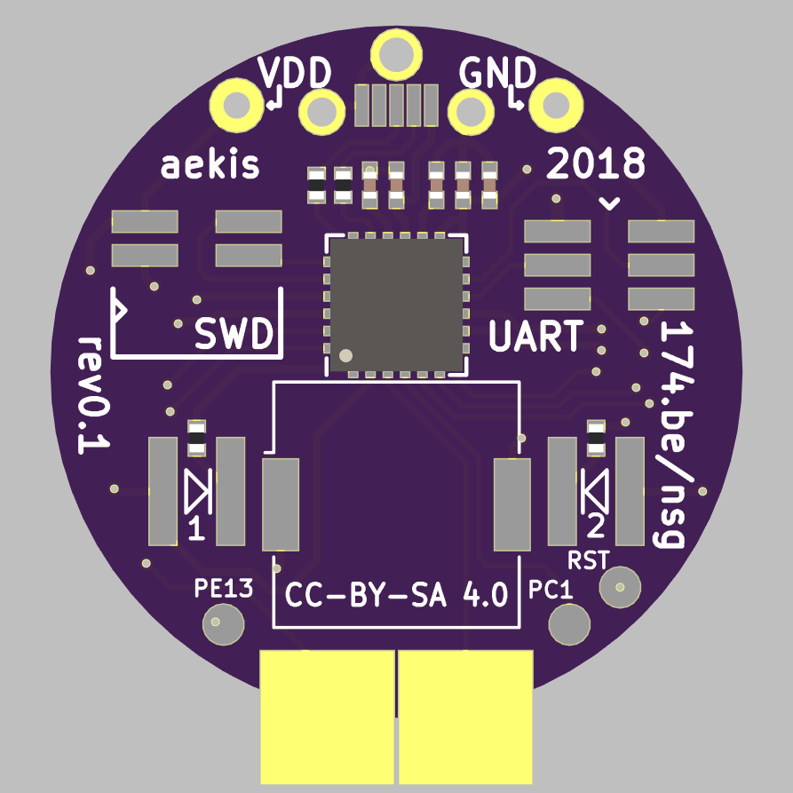

# Noodle Spawnling Gecko Brain

This is a brain for a [noodle spawnling](http://roboticarts.zoness.com/2017/12/19/birthing-a-noodle-spawnling/), a small 3d-printed robot figurine designed by spetku.

</img>

## Features
  * Silicon Labs Happy Gecko EFM32HG309 microcontroller (the same one as on the [tomu.im](https://tomu.im))
  * buzzer
  * 2 LEDs
  * capacitive touch button area
  * micro USB connector
  * SWD debug and a combined (LEU/US)ART header
  * CR2032 coincell holder

For the BOM see [doc/bom.csv](doc/bom.csv).

## Additional tools
Besides KiCad, some additional tools were used on this project:
  * For BOM management I used [BOMs Away](https://github.com/Jeff-Ciesielski/Boms-Away)
  * [doc/stickerbom.pdf](doc/stickerbom.pdf) was generated with [StickerBOM](https://github.com/adamgreig/agg-kicad/wiki/StickerBOM)

## License
CC BY-SA 4.0 (https://creativecommons.org/licenses/by-sa/4.0/)
